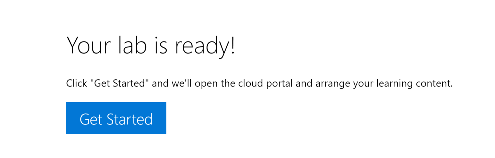
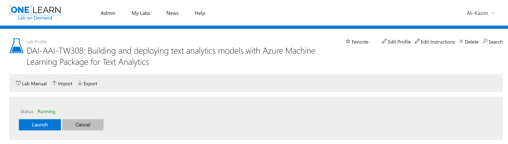
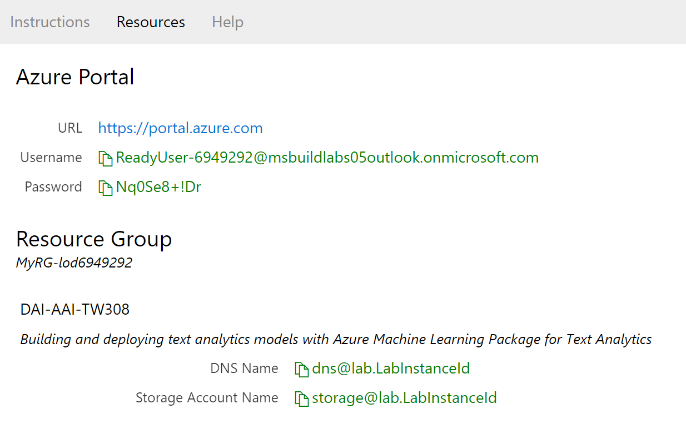
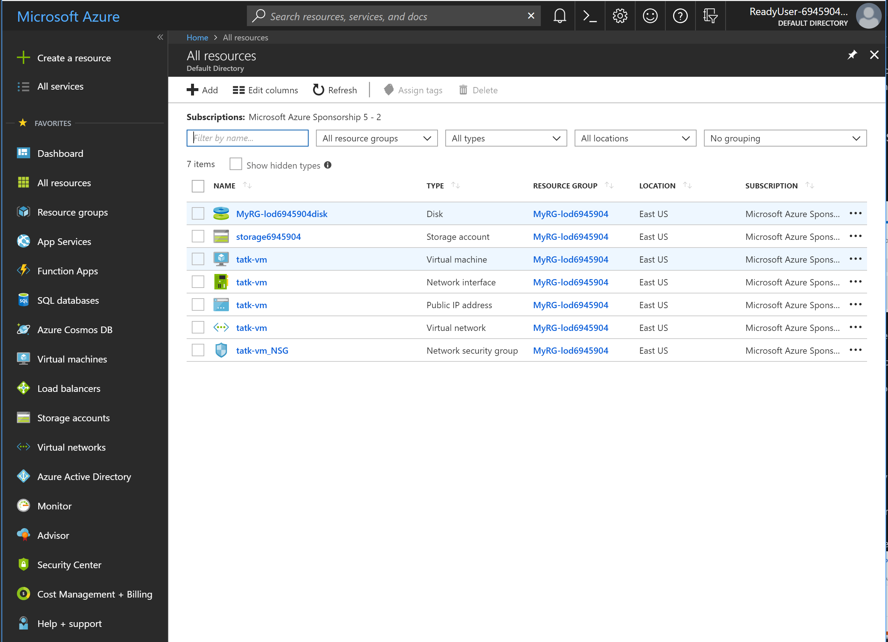
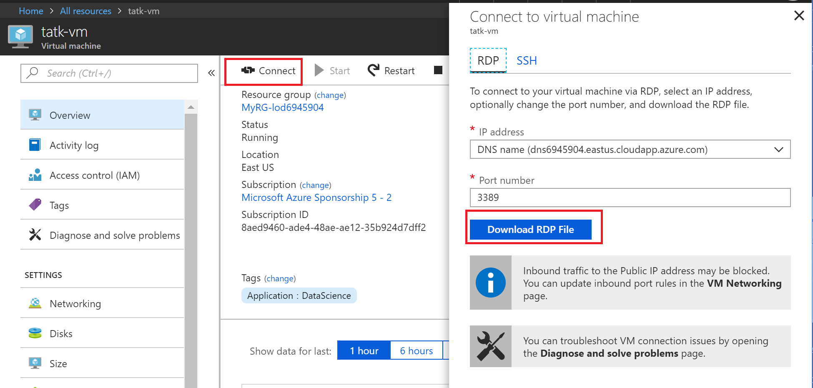
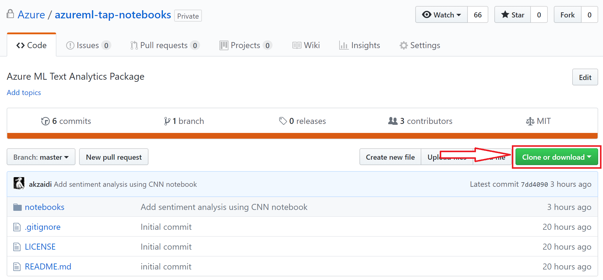

# Azure ML Text Analytics Package Notebooks

This repository contains notebooks demonstrating the use of the Azure ML Text Analytics package. Further documentation about the package can be found on the package [homepage](https://docs.microsoft.com/en-us/azure/machine-learning/service/reference-python-package-overview#azure-ml-package-for-text-analytics).

## Instructions for Accessing Labs from Learn On Demand Systems

- Launch the lab by clicking the icon for Launch:

- This should launch two new browser windows.
- Find your _lab credentials for Azure_ by clicking on the resources tab:

- Use these credentials to log into the Azure portal in the browser pointing to Azure
- On the Azure browser, click on `All Services` in the left pane.

- Click on the service titled `tatk-vm`
- Download the RDP file by using `Connect` -> `Download RDP File` 

- Use the `Resources` tab to obtain your credentials for the VM.
- Connect to the VM using the following credentials:
    * `ready`
    * `ReadyLabs123!`
- Launch Jupyter and follow the instructor

## Instructions for Installing the Package on Your Own DSVM / DLVM

1. **Requirement**: DSVM/DLVM or a Windows machine with Azure ML Workbench installed.
2. Please clone this repository: `git clone https://github.com/Azure/azureml-tap-notebooks.git`
    - or, click on the green download button 
3. If needed, extract the folder.
4. Open the command prompt in Azure ML: **File > Open Command Prompt**.
5. Navigate to the extracted directory: `chdir <location>\install`
6. If you have a GPU machine with CUDA 8 and CUDNN 5 enabled:
    `pip install tensorflow-gpu==1.6`
    - otherwise:
    `pip install tensorflow==1.6`
7. `setup.bat`
8. Navigate to notebooks: `chdir ..\notebooks`. 
9. Ensure you are in the notebooks directory: `echo %cd%`
    - should be something like (the last two directories are what matter): `C:\Users\alizaidi\Documents\nlpdev\tatk-repos\azureml-tap-notebooks\notebooks`
10. Launch a notebook server `az ml noteboook start`

## Useful Links

### [Azure ML Text Analytics Documentation](https://docs.microsoft.com/en-us/azure/machine-learning/service/reference-python-package-overview#azure-ml-package-for-text-analytics)

# Contributing

This project welcomes contributions and suggestions.  Most contributions require you to agree to a
Contributor License Agreement (CLA) declaring that you have the right to, and actually do, grant us
the rights to use your contribution. For details, visit https://cla.microsoft.com.

When you submit a pull request, a CLA-bot will automatically determine whether you need to provide
a CLA and decorate the PR appropriately (e.g., label, comment). Simply follow the instructions
provided by the bot. You will only need to do this once across all repos using our CLA.

This project has adopted the [Microsoft Open Source Code of Conduct](https://opensource.microsoft.com/codeofconduct/).
For more information see the [Code of Conduct FAQ](https://opensource.microsoft.com/codeofconduct/faq/) or
contact [opencode@microsoft.com](mailto:opencode@microsoft.com) with any additional questions or comments.
