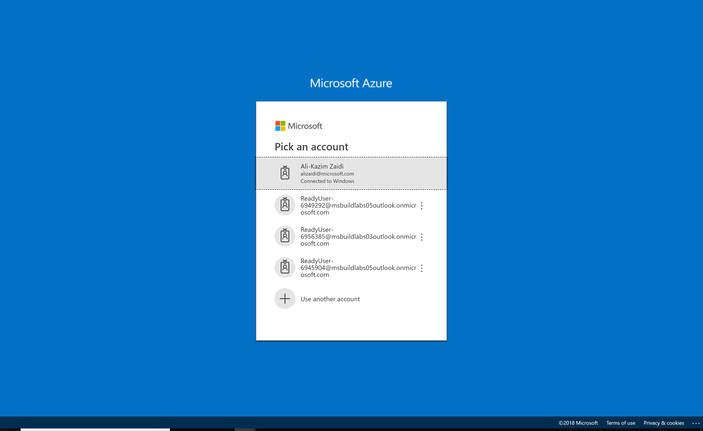
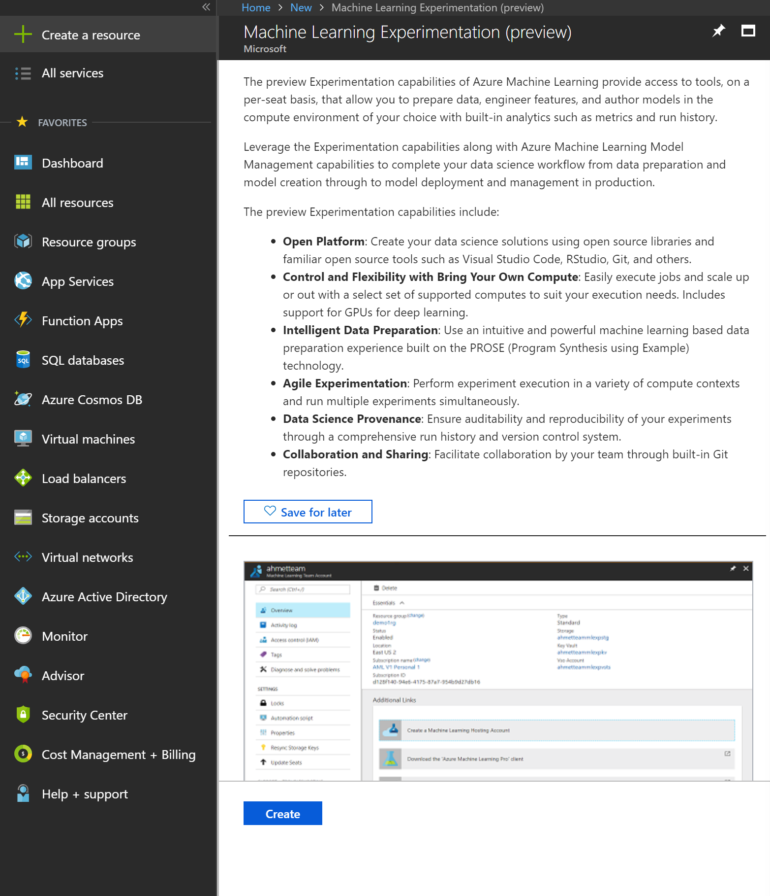
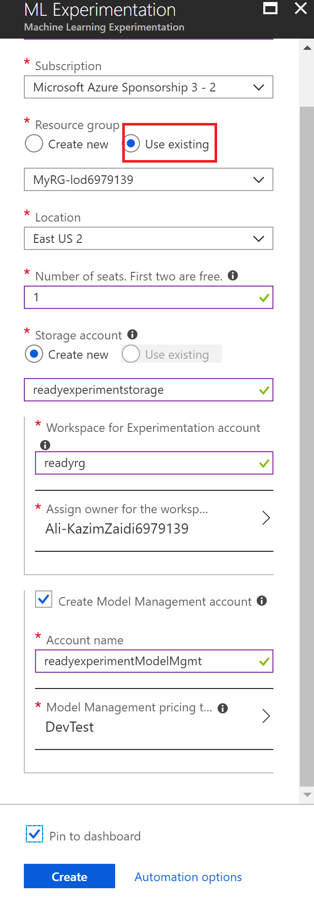
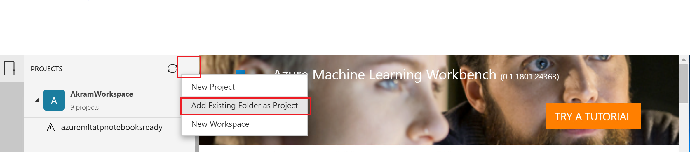
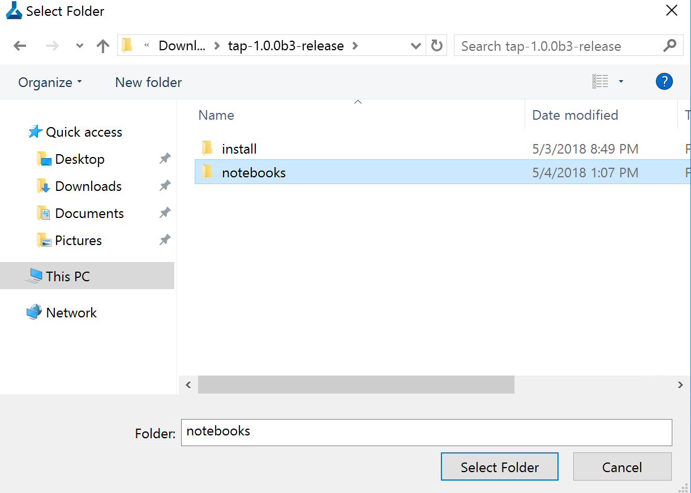
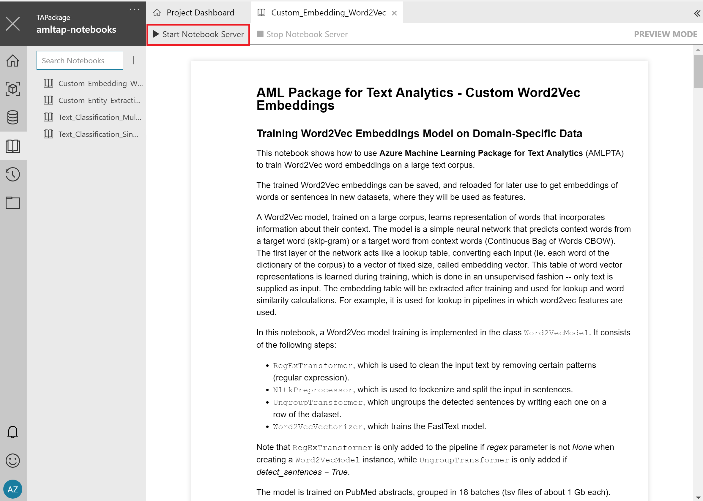

# Azure ML Text Analytics Package Notebooks

This repository contains notebooks demonstrating the use of the Azure ML Text Analytics package. Further documentation about the package can be found on the package [homepage](https://docs.microsoft.com/en-us/azure/machine-learning/service/reference-python-package-overview#azure-ml-package-for-text-analytics).

## Instructions for Accessing Labs from Learn On Demand Systems

**NOTE**: Please use Firefox or Chrome to run the labs. Using Edge or IE is not supported.

When you open the lab link, you should have two window browser tabs open in your default browser: 1. Azure Portal signin. 2. The lab homepage.

The Azure portal sign-in should look like:

The second link, the lab homepage, should look like:

- Find your lab credentials by clicking _Resources_ pane in the lab homepage:

- Launch the lab by clicking the icon for _Launch_.
- Use the  credentials accessed earlier to log into the Azure portal in the browser pointing to Azure
- On the Azure browser, click on `All Resources` in the left pane.

- Click on the service titled `tatk-vm`
- Download the RDP file by using `Connect` -> `Download RDP File` 

- Connect to the VM using the following credentials:
    * `ready`
    * `ReadyLabs123!`
- Create an Azure Machine Learning Experimentation Account with your temporary Lab subscription:

    1. Create a Machine Learning Experimentation Service:
    
    1. Note: your subscription cannot create new resource groups, so make sure you use the already created (there is only one resource group in the subscription):
    
    1. A single seat and the DevTest model management account will suffice.

- Open the Azure Workbench Link on the desktop of your virtual machine:

- Login using your lab credentials.
- Click the `+` and select _Add Existing Folder as Project`.

- Select the folder `C:\Users\ready\Downloads\tap-1.0.0b3-release\notebooks` to your workspace:

- Open the Notebooks pane in the Workbench:

- Select a notebook and click _Start notebook server_.

## Useful Links

### [Azure ML Text Analytics Documentation](https://docs.microsoft.com/en-us/azure/machine-learning/service/reference-python-package-overview#azure-ml-package-for-text-analytics)

# Contributing

This project welcomes contributions and suggestions.  Most contributions require you to agree to a
Contributor License Agreement (CLA) declaring that you have the right to, and actually do, grant us
the rights to use your contribution. For details, visit https://cla.microsoft.com.

When you submit a pull request, a CLA-bot will automatically determine whether you need to provide
a CLA and decorate the PR appropriately (e.g., label, comment). Simply follow the instructions
provided by the bot. You will only need to do this once across all repos using our CLA.

This project has adopted the [Microsoft Open Source Code of Conduct](https://opensource.microsoft.com/codeofconduct/).
For more information see the [Code of Conduct FAQ](https://opensource.microsoft.com/codeofconduct/faq/) or
contact [opencode@microsoft.com](mailto:opencode@microsoft.com) with any additional questions or comments.
